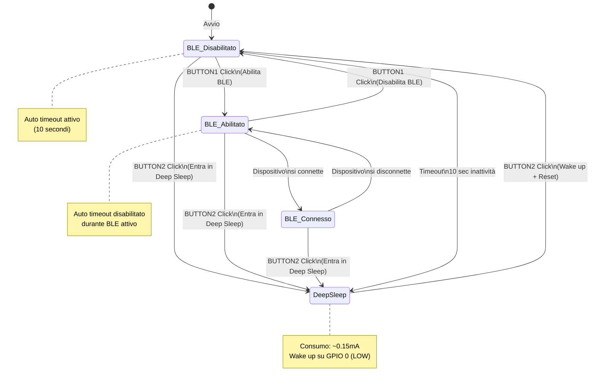
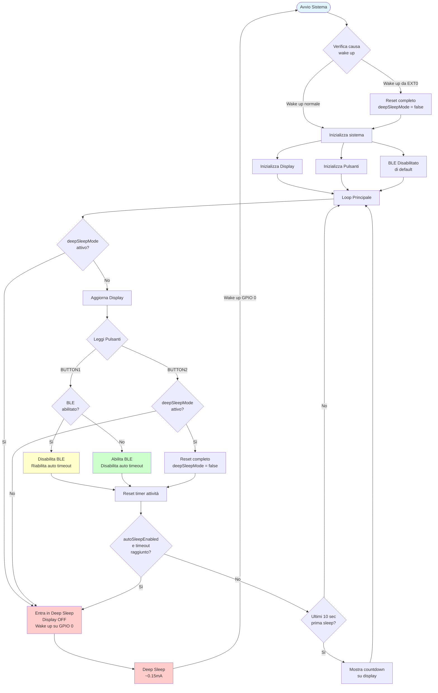
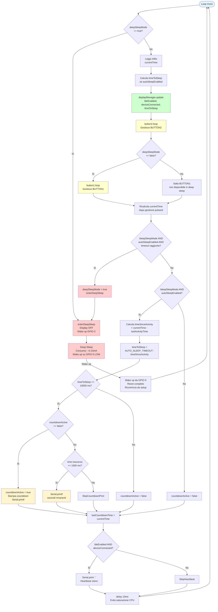

# MagicaTrackerBLE - ESP32 BLE Auto Tracker

Progetto per dispositivo di tracciamento BLE automatico compatibile con l'app **Magica**. Il dispositivo utilizza un ESP32 su scheda LILYGO T-Display per fornire funzionalità di tracciamento Bluetooth Low Energy con gestione avanzata del risparmio energetico tramite deep sleep.

## 📋 Panoramica

**MagicaTrackerBLE** è un tracker BLE che:
- Pubblica un servizio BLE per essere rilevato dall'app Magica
- Gestisce automaticamente il risparmio energetico tramite deep sleep
- Fornisce un'interfaccia utente su display TFT integrato
- Consente controllo manuale tramite due pulsanti hardware

### Hardware Utilizzato

- **Scheda**: LILYGO T-Display (ESP32)
- **Display**: ST7789 TFT 135x240 pixel
- **Alimentazione**: 12V auto → convertitore 5V → ESP32
- **Pulsanti**: 
  - BUTTON1 (GPIO 35): Toggle servizio BLE
  - BUTTON2 (GPIO 0): Toggle deep sleep mode

## 🏗️ Architettura del Sistema

### Componenti Principali

1. **BLE Server**: Gestisce advertising e connessioni Bluetooth
2. **Display Manager**: Gestisce l'interfaccia utente sul display TFT
3. **Deep Sleep Manager**: Gestisce le modalità di risparmio energetico
4. **Button Handler**: Gestisce gli input utente dai pulsanti

### Stati del Sistema

Il sistema può trovarsi in uno dei seguenti stati:

- **BLE Disabilitato**: Stato iniziale, nessun advertising BLE attivo
- **BLE Abilitato**: Advertising BLE attivo, in attesa di connessione
- **BLE Connesso**: Connessione BLE stabilita con dispositivo esterno
- **Deep Sleep Mode**: Sistema in modalità deep sleep per risparmio energetico

## 🔄 Logica di Funzionamento

### Macchina a Stati



### Flusso di Controllo Principale



### Gestione BLE

Il sistema gestisce il servizio BLE con le seguenti caratteristiche:

- **Nome dispositivo**: `MagicaCar` (configurabile)
- **Service UUID**: `0000180a-0000-1000-8000-00805f9b34fb`
- **Characteristic UUID**: `00002a29-0000-1000-8000-00805f9b34fb`
- **Proprietà**: READ e NOTIFY

**Comportamento**:
- BLE inizialmente **disabilitato** all'avvio
- BUTTON1 attiva/disattiva il servizio BLE
- Quando BLE è attivo, l'auto timeout viene **disabilitato**
- Quando BLE è disattivato, l'auto timeout viene **riabilitato**

### Gestione Deep Sleep

Il sistema implementa una gestione avanzata del deep sleep:

**Entrata in Deep Sleep**:
- Manuale: Premere BUTTON2
- Automatica: Dopo 10 secondi di inattività (solo se BLE disabilitato)

**Uscita da Deep Sleep**:
- Wake up su GPIO 0 (BUTTON2) quando il pulsante va LOW
- Dopo wake up, il sistema esegue un **reset completo** per ricominciare da zero

**Ottimizzazioni**:
- Display spento prima di entrare in deep sleep
- Verifica stato pin prima di configurare wake up (evita loop infiniti)
- Pulizia wake up sources per evitare conflitti
- Consumo ridotto a ~0.15mA durante deep sleep

### Gestione Display

Il `DisplayManager` gestisce l'interfaccia utente con:

**Componenti UI**:
- **Header**: Titolo "MAGICA CAR TRACKER"
- **Status BLE**: Indicatore ON/OFF con colore verde/bianco
- **Stato Connessione**: 
  - "CONNESSO" (verde) con animazione heartbeat quando connesso
  - "In attesa" (giallo) con animazione punti quando BLE attivo ma non connesso
  - "Inattivo" (bianco) quando BLE disabilitato
- **Countdown**: Barra di progresso per auto sleep (ultimi 10 secondi)
- **Footer**: Istruzioni pulsanti "B1:BLE  B2:SLEEP"

**Ottimizzazioni**:
- Aggiornamento UI ogni 100ms
- Redraw completo solo quando necessario
- Animazioni fluide per heartbeat e ricerca

### Gestione Pulsanti

**BUTTON1 (GPIO 35)**:
- **Funzione**: Toggle servizio BLE on/off
- **Comportamento**: 
  - Disabilitato quando in deep sleep mode
  - Quando abilita BLE → disabilita auto timeout
  - Quando disabilita BLE → riabilita auto timeout e resetta timer

**BUTTON2 (GPIO 0)**:
- **Funzione**: Toggle deep sleep mode
- **Comportamento**:
  - Se in deep sleep → esce e fa reset completo
  - Se non in deep sleep → entra in deep sleep
  - Attende rilascio pulsante prima di entrare in deep sleep (evita wake up immediato)
  - Configurato come wake up source per deep sleep (EXT0, wake on LOW)

### Auto Timeout Deep Sleep

Il sistema implementa un meccanismo di auto sleep intelligente:

- **Timeout**: 10 secondi di inattività
- **Attivo**: Solo quando BLE è disabilitato
- **Disabilitato**: Quando BLE è attivo (per permettere connessioni)
- **Countdown**: Visualizzato negli ultimi 10 secondi prima del sleep
- **Reset**: Qualsiasi interazione utente resetta il timer

**Logica**:
```
Se (BLE disabilitato) AND (auto timeout abilitato) AND (10 sec senza attività):
    → Entra in deep sleep automatico
```

### Logica Dettagliata del Loop Principale

Il seguente diagramma mostra la logica completa implementata nel `loop()` principale con tutti i controlli, le condizioni e i flussi di esecuzione:



### Logica delle Funzioni Principali

Diagramma che mostra il flusso interno delle funzioni chiave del sistema:

```mermaid
flowchart TD
    subgraph EnableBLE["enableBLE()"]
        EB1{bleEnabled<br/>== true?} -->|Sì| EBReturn[Return<br/>Già abilitato]
        EB1 -->|No| EB2{deepSleepMode<br/>== true?}
        EB2 -->|Sì| EBError[Stampa errore<br/>BLE non disponibile<br/>in deep sleep]
        EB2 -->|No| EB3{pServer<br/>== NULL?}
        EB3 -->|Sì| EBInit[BLEDevice::init<br/>Crea server<br/>Crea service<br/>Crea characteristic]
        EB3 -->|No| EBSkipInit[Salta inizializzazione]
        EBInit --> EBStartAdv[Configura advertising<br/>BLEDevice::startAdvertising]
        EBSkipInit --> EBStartAdv
        EBStartAdv --> EBSetFlag[bleEnabled = true<br/>displayManager.requestRedraw]
        EBSetFlag --> EBEnd[Return]
    end
    
    subgraph DisableBLE["disableBLE()"]
        DB1{bleEnabled<br/>== false?} -->|Sì| DBReturn[Return<br/>Già disabilitato]
        DB1 -->|No| DB2{pServer<br/>!= NULL?}
        DB2 -->|Sì| DBStopAdv[pServer->getAdvertising<br/>->stop<br/>deviceConnected = false]
        DB2 -->|No| DBSkipStop
        DBStopAdv --> DBSetFlag[bleEnabled = false<br/>displayManager.requestRedraw]
        DBSkipStop --> DBSetFlag
        DBSetFlag --> DBEnd[Return]
    end
    
    subgraph EnterDeepSleep["enterDeepSleep()"]
        EDS1[Stampa messaggio<br/>Entrando in deep sleep]
        EDS1 --> EDS2[displayManager.turnOff<br/>Spegni display]
        EDS2 --> EDS3{esp_sleep_is_valid_wakeup_gpio<br/>GPIO_NUM_0?}
        EDS3 -->|No| EDSError[Stampa errore<br/>GPIO 0 non valido<br/>Return]
        EDS3 -->|Sì| EDS4[esp_sleep_disable_wakeup_source<br/>Pulizia wake up sources]
        EDS4 --> EDS5[pinMode BUTTON2_PIN<br/>INPUT_PULLUP]
        EDS5 --> EDS6[delay 5ms<br/>Stabilizza pin]
        EDS6 --> EDS7[digitalRead BUTTON2_PIN<br/>Verifica stato]
        EDS7 --> EDS8{pinState<br/>== LOW?}
        EDS8 -->|Sì| EDSWarning[Stampa warning<br/>Pin LOW - annulla sleep<br/>Return]
        EDS8 -->|No| EDS9[esp_sleep_enable_ext0_wakeup<br/>GPIO_NUM_0, LOW]
        EDS9 --> EDSSetFlag[deepSleepMode = true<br/>bootCount++]
        EDSSetFlag --> EDS10[esp_deep_sleep_start<br/>ENTRA IN SLEEP]
        EDS10 --> EDSNever[Questa linea<br/>non verrà mai eseguita]
    end
    
    subgraph HandleButton1["handleButton1Click()"]
        HB1_1{deepSleepMode<br/>== true?} -->|Sì| HB1Error[Stampa errore<br/>BLE non disponibile<br/>Return]
        HB1_1 -->|No| HB1_2[lastActivityTime = millis<br/>countdownActive = false<br/>Reset timer]
        HB1_2 --> HB1_3{bleEnabled<br/>== true?}
        HB1_3 -->|Sì| HB1Disable[disableBLE<br/>autoSleepEnabled = true<br/>lastActivityTime = millis]
        HB1_3 -->|No| HB1Enable[enableBLE<br/>autoSleepEnabled = false]
        HB1Disable --> HB1Redraw[displayManager.requestRedraw]
        HB1Enable --> HB1Redraw
        HB1Redraw --> HB1End[Return]
    end
    
    subgraph HandleButton2["handleButton2Click()"]
        HB2_1[lastActivityTime = millis<br/>countdownActive = false<br/>Reset timer]
        HB2_1 --> HB2_2{deepSleepMode<br/>== true?}
        HB2_2 -->|Sì| HB2Exit[deepSleepMode = false<br/>delay 100ms<br/>ESP.restart<br/>Reset completo]
        HB2_2 -->|No| HB2_3{bleEnabled<br/>== true?}
        HB2_3 -->|Sì| HB2DisableBLE[disableBLE<br/>Spegni BLE prima]
        HB2_3 -->|No| HB2SkipDisable
        HB2DisableBLE --> HB2Wait[Attendi rilascio<br/>BUTTON2<br/>max 2000ms]
        HB2SkipDisable --> HB2Wait
        HB2Wait --> HB2Enter[enterDeepSleep<br/>Entra in sleep]
        HB2Enter --> HB2Never[Questa linea<br/>non verrà mai eseguita]
    end
    
    style EBError fill:#ffcccc
    style EDSError fill:#ffcccc
    style EDSWarning fill:#fff4cc
    style HB1Error fill:#ffcccc
    style EDS10 fill:#ffcccc
    style HB2Exit fill:#ccffcc
```



## 📊 Variabili di Stato

### Variabili Globali Principali

- `bleEnabled`: Stato del servizio BLE (true/false)
- `deviceConnected`: Stato connessione BLE (true/false)
- `deepSleepMode`: Stato deep sleep persistente in RTC memory
- `autoSleepEnabled`: Flag per controllo esplicito auto timeout
- `lastActivityTime`: Timestamp ultimo input utente
- `countdownActive`: Flag per countdown attivo

### RTC Memory

Variabili persistenti attraverso deep sleep (usando `RTC_DATA_ATTR`):
- `deepSleepMode`: Mantiene lo stato deep sleep tra i cicli
- `bootCount`: Contatore boot per debug

## 🔧 Configurazione

### Parametri Configurabili

```cpp
// Nome dispositivo BLE
#define DEVICE_NAME "MagicaCar"

// UUID servizio e caratteristica
#define SERVICE_UUID        "0000180a-0000-1000-8000-00805f9b34fb"
#define CHARACTERISTIC_UUID "00002a29-0000-1000-8000-00805f9b34fb"

// Pin pulsanti
#define BUTTON1_PIN 35  // Toggle BLE
#define BUTTON2_PIN 0   // Toggle deep sleep

// Timeout auto sleep (millisecondi)
#define AUTO_SLEEP_TIMEOUT 10000  // 10 secondi
```

### Dipendenze

- `BLEDevice.h` - Gestione BLE ESP32
- `BLEServer.h` - Server BLE
- `BLEUtils.h` - Utility BLE
- `BLE2902.h` - Descriptor BLE
- `Button2.h` - Gestione pulsanti avanzata
- `DisplayManager.h` - Gestione display TFT
- `driver/rtc_io.h` - Controllo RTC GPIO
- `esp_sleep.h` - Funzioni deep sleep

## 📱 Utilizzo

### Avvio Normale

1. Il sistema si avvia con BLE **disabilitato**
2. Auto timeout **attivo** (10 secondi)
3. Display mostra stato "BLE: OFF" e "Inattivo"

### Abilitare BLE

1. Premere **BUTTON1**
2. BLE si attiva e inizia advertising
3. Auto timeout viene **disabilitato**
4. Display mostra "BLE: ON" e "In attesa..."

### Connessione Dispositivo

1. Quando un dispositivo si connette:
   - Display mostra "CONNESSO" con animazione heartbeat
   - Serial monitor mostra "CONNESSO - Tracking attivo"

2. Quando si disconnette:
   - Sistema riavvia automaticamente l'advertising
   - Display torna a "In attesa..."

### Entrare in Deep Sleep

**Metodo 1 - Manuale**:
1. Premere **BUTTON2**
2. Sistema disabilita BLE (se attivo)
3. Attende rilascio pulsante
4. Entra in deep sleep (display spento)

**Metodo 2 - Automatico**:
1. Lasciare il sistema inattivo per 10 secondi (con BLE disabilitato)
2. Countdown appare negli ultimi 10 secondi
3. Sistema entra automaticamente in deep sleep

### Uscire da Deep Sleep

1. Premere **BUTTON2** (GPIO 0 va LOW)
2. Sistema si sveglia
3. Esegue reset completo
4. Ricomincia da `setup()` con stato normale

## 🔋 Consumo Energetico

- **Operativo normale**: ~60mA (con display acceso)
- **BLE attivo**: ~80-100mA (con advertising)
- **BLE connesso**: ~100-120mA
- **Deep sleep**: ~0.15mA (display spento, CPU in deep sleep)

**Ottimizzazioni implementate**:
- Display spento durante deep sleep
- BLE disabilitato durante deep sleep
- Auto timeout per entrare automaticamente in deep sleep
- Wake up solo su evento esterno (pulsante)

## 🐛 Debug e Troubleshooting

### Serial Monitor

Il sistema fornisce output dettagliato su Serial Monitor (115200 baud):

- Stato boot e causa wake up
- Transizioni di stato BLE
- Eventi pulsanti
- Countdown auto sleep
- Heartbeat quando connesso

### Problemi Comuni

**BLE non si attiva**:
- Verificare che non si sia in deep sleep mode
- Controllare che BUTTON1 funzioni correttamente
- Verificare output Serial Monitor

**Deep sleep non funziona**:
- Verificare che GPIO 0 sia configurato correttamente
- Controllare che il pulsante non sia premuto durante entrata in sleep
- Verificare che il display sia spento prima di deep sleep

**Wake up immediato da deep sleep**:
- Verificare che il pulsante sia rilasciato prima di entrare in sleep
- Controllare pull-up su GPIO 0
- Verificare che non ci siano conflitti con altre configurazioni GPIO

## 📝 Note Tecniche

### GPIO 0 (BUTTON2)

- Pin critico per deep sleep wake up
- Deve essere configurato come INPUT_PULLUP
- Wake up configurato come EXT0, trigger LOW
- Verifica stato pin prima di configurare wake up per evitare loop

### GPIO 35 (BUTTON1)

- Pin ADC-only, non supporta INPUT_PULLUP interno
- Richiede pull-up esterno sulla scheda
- Configurato come INPUT con activeLow=true nella libreria Button2

### RTC Memory

- Variabili `RTC_DATA_ATTR` persistono attraverso deep sleep
- Utili per mantenere stato tra cicli sleep/wake
- Limitato a ~8KB di spazio disponibile

## 📄 Licenza

Questo progetto è fornito come esempio educativo. Verificare le licenze delle librerie utilizzate.

## 🔗 Risorse

- [LILYGO T-Display Documentation](https://wiki.lilygo.cc/)
- [ESP32 BLE Documentation](https://docs.espressif.com/projects/esp-idf/en/latest/esp32/api-reference/bluetooth/index.html)
- [ESP32 Deep Sleep Guide](https://docs.espressif.com/projects/esp-idf/en/latest/esp32/api-reference/system/sleep_modes.html)

---

**Versione**: 1.0  
**Ultimo aggiornamento**: 2025

